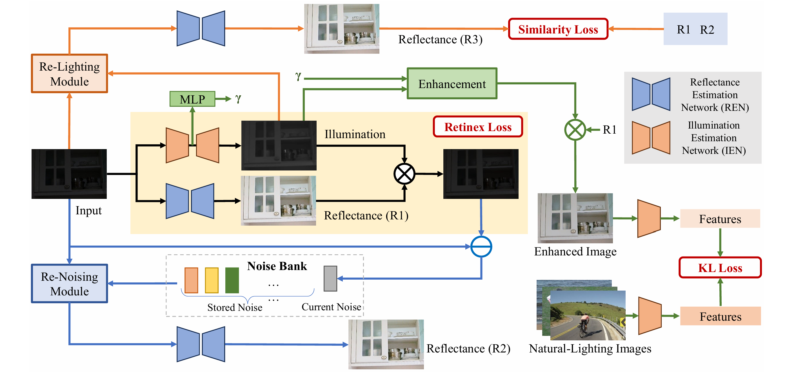

# Re-degradation-guided self-supervised low-light image enhancement
## 📋 Project Overview

Re-degradation-guided self-supervised low-light image enhancement unifies model-driven priors and data-driven learning for noise-free and perceptually faithful low-light image enhancement in a self-supervised manner. Based on Retinex theory, our method employs two synergistic re-degradation mechanisms, re-noising for reflectance consistency and re-lighting for illumination invariance, to jointly disentangle reflectance and illumination while suppressing noise. The enhanced image is reconstructed by refining illumination and recombining it with denoised reflectance. A self-adaptive adjustment strategy further ensures adaptive and high-quality illumination enhancement.
<div align=center></div>


### 🔧 Environment Setup
In this project, we use Ubuntu 22.04.5, Python 3.9.19, Pytorch 2.7.1+cu126 and one NVIDIA RTX 3090Ti GPU. And you need to cd to the main directory of this project.
  
### 🎯 Testing

The pretrained model is in the ./weight.

Check the model and image paths in test.py, and then run:

```
python test.py
```

### 💻 Training

To train the model, you need to prepare the training dataset.

Check the dataset path in train.py, and then run:
```
python train.py
```

### 🔍 Metric Calculation

To calculate the metrics, you need to prepare change the paths of enhanced images and reference images.

Check the data paths in measure.py, and then run:
```
python measure.py
```

## ✅ Citation

If you find our codes useful in your research, please cite our paper.

 
